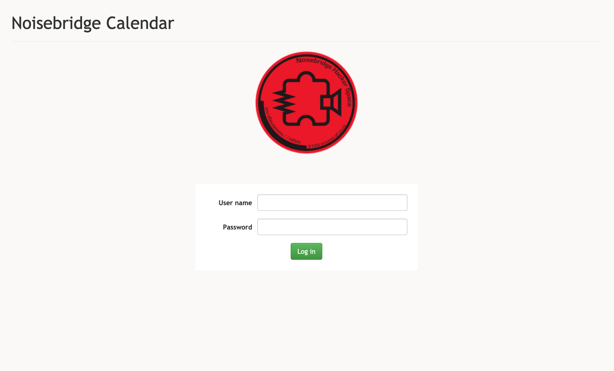
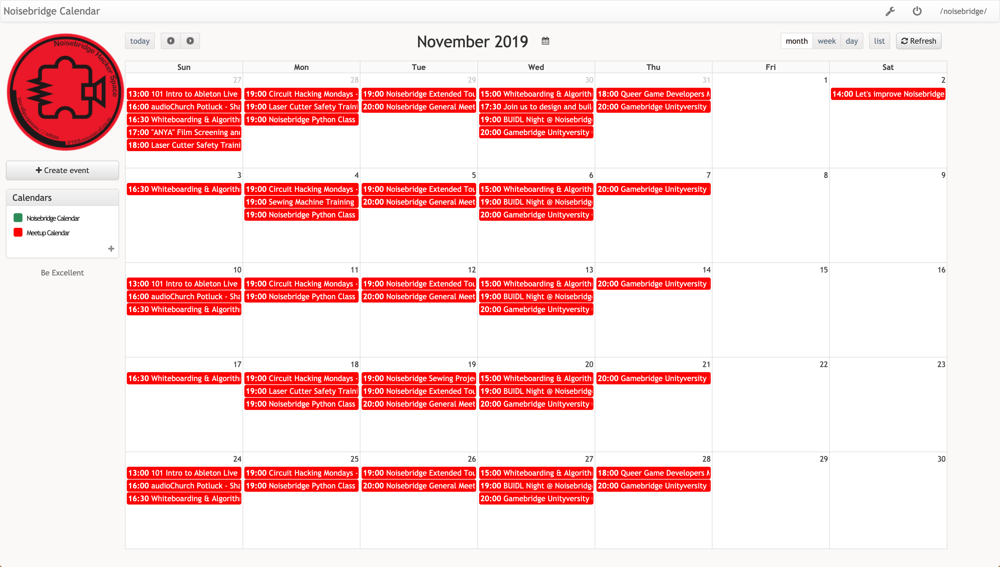

# nb-events

An application for setting up and compiling events across noisebridge

# How it works

There are number of things going on:
* a CalDAV server - [radicale](https://radicale.org/)
* a CalDAV client - [AgenDAV](https://agendav.org/)
* a meetup.com event scraper

Radicale holds all the events. AgenDAV lets you add new events manually, or reoccuring events. The meetup.com events are scraped on a regular basis, and then injected into radicale server.


# Usage

Bring up the services:
```
make up
```

In a separate process, run:
```
make setup
```

You'll now need to enter a password (it can be blank even) for the radicale calendars.

Now go to `localhost:8080` to login:




* Username: `noisebridge`
* Password: the password you entered earlier.

The scraper will run in a few minutes - then you should see:




# License

Everything is [GPLv3](https://www.gnu.org/licenses/quick-guide-gplv3.en.html)
